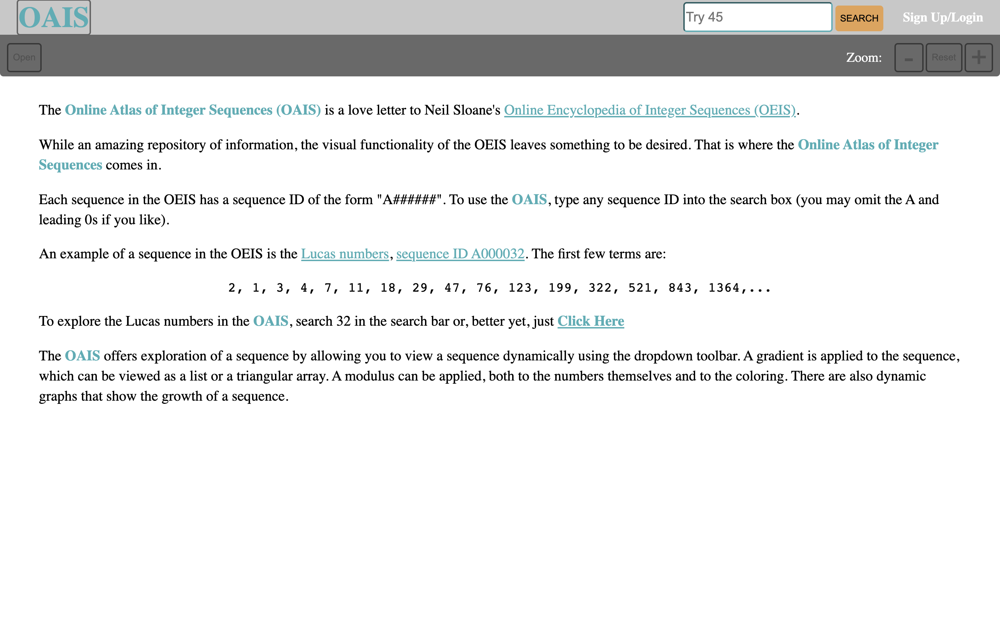

# The Online Atlas of Integer Sequences

The Online Atlas of Integer Sequences (OAIS) is a love letter to Neil Sloane's [Online Encyclopedia of Integer Sequences (OEIS)](http://oeis.org/).

While an amazing repository of information, the visual functionality of the OEIS leaves something to be desired. That is where the Online Atlas of Integer Sequences comes in.

Each sequence in the OEIS has a sequence ID of the form "A######". To use the OAIS, type any sequence ID into the search box (the user may omit the A and leading 0s if they like).

An example of a sequence in the OEIS is the [Lucas numbers, sequence ID A000032](http://oeis.org/A000032). The first few terms are:

2, 1, 3, 4, 7, 11, 18, 29, 47, 76, 123, 199, 322, 521, 843, 1364,...

To explore the Lucas numbers in the OAIS, search 32 in the search bar.

The OAIS offers exploration of a sequence by allowing the user to view a sequence dynamically using the dropdown toolbar. A gradient is applied to the sequence, which can be viewed as a list or a triangular array. A modulus can be applied, both to the numbers themselves and to the coloring. There are also dynamic graphs that show the growth of a sequence.

The app has token-based user authentication to save favorite sequences.

---

## The App In Action

## Technologies Used:

HTML, CSS, Javascript, Mongoose, Express, React, Node.js, Axios, Bcrypt, Plotly.js. Deployed with Heroku.

## Getting Started:

Check out the OAIS [here](https://online-atlas-integer-sequences.herokuapp.com/signup). The production Trello can be viewed [here](https://trello.com/b/nmh4WFyH/oais).

## Future Improvement/Enhancements

- Renaming in the profile page does not persist after logging out. However, favorited sequences do.
- Add further styling, e.g. borders
- Fix overlap issues for sequence view and graph view vis a vis the navbar
- Standardize the sequence id so it is always saved as A######.
- Bundle similar states into more managable object states.
- Have the number of chevrons change dynamically based on the width of a chevron (and ideally the width of the window).

Note: The favicon's font is DM Mono Bold.
